<div align="center">

# 📊 DataLens AI

### *Intelligent Data Analytics Agent*

<p align="center">
  
  
  
</p>

**An autonomous AI-powered data analytics system that transforms raw datasets into professional visualizations and interactive dashboards**

<p align="center">
  <a href="https://huggingface.co/spaces/adinathjagtap/ai-data-analysis-agent">🚀 Live Demo (V1)</a> •
  <a href="https://youtube.com">📺 Video Demo</a> •
</p>

*Capstone Project for Google's 5-Day AI Agents Intensive Course*


</div>

## 📖 Table of Contents

- [🎯 Problem & Solution](#-problem--solution)
- [🏗️ System Architecture](#️-system-architecture)
- [✨ Core Capabilities](#-core-capabilities)
- [🚀 Quick Start](#-quick-start)
- [🎨 Features](#-features)
- [🔧 Technical Stack](#-technical-stack)
- [📊 Output Deliverables](#-output-deliverables)
- [📈 Use Cases](#-use-cases)
- [🛡️ Security](#️-security)
- [📚 Project Structure](#-project-structure)

<br>

## 🎯 Problem & Solution

### The Challenge

Modern data analysis faces critical barriers:

- **Complexity**: Multiple tools required for cleaning, analysis, and visualization
- **Technical Skills**: Demands expertise in Python, pandas, and visualization libraries
- **Time Investment**: Manual processes consume hours of productive time
- **Accessibility**: Non-technical users locked out of advanced analytics
- **Inconsistency**: Variable quality based on individual expertise

### Our Solution

**DataLens AI** democratizes data analysis through AI automation:

```
Raw Data → AI Processing → Professional Insights
   ↓            ↓                    ↓
Upload → Gemini Analysis → Interactive Dashboard
```

**Key Benefits:**
- 🤖 **AI-Driven**: Leverages Google's Gemini API for intelligent processing
- ⚡ **Fast**: Hours of work reduced to minutes
- 🎯 **Complete**: End-to-end pipeline in a single notebook
- 🚀 **No-Code**: Upload and process without manual coding
- 📊 **Professional**: Publication-quality visualizations


## 🏗️ System Architecture

### Pipeline Workflow

```mermaid
graph LR
    A[🔧 Setup Environment] --> B[🤖 Initialize Gemini AI]
    B --> C[📁 Load Data]
    C --> D[🧠 AI Analysis & Cleaning]
    D --> E[📊 Generate Visualizations]
    E --> F[📈 Interactive Dashboard]
    
    style A fill:#e3f2fd,stroke:#1976d2,stroke-width:3px,color:#000000
    style B fill:#f3e5f5,stroke:#7b1fa2,stroke-width:3px,color:#000000
    style C fill:#fff3e0,stroke:#f57c00,stroke-width:3px,color:#000000
    style D fill:#e8f5e9,stroke:#388e3c,stroke-width:3px,color:#000000
    style E fill:#fce4ec,stroke:#c2185b,stroke-width:3px,color:#000000
    style F fill:#e0f2f1,stroke:#00796b,stroke-width:3px,color:#000000
```



### Component Architecture

```
┌─────────────────┐    ┌──────────────────┐    ┌──────────────────┐
│   Data Input    │    │  AI Processing   │    │ Output Generation│
│                 │    │                  │    │                  │
│ • CSV/Excel     │───▶│ • Gemini AI     │───▶│ • Visualizations │
│ • Raw Data      │    │ • Analysis       │    │ • Dashboard      │
│ • File Upload   │    │ • Code Generation│    │ • Reports        │
└─────────────────┘    └──────────────────┘    └──────────────────┘
         │                        │                        │
         └────────────────────────┼────────────────────────┘
                                  │
                         ┌──────────────────┐
                         │ Data Processing  │
                         │                  │
                         │ • Cleaning       │
                         │ • Transformation │
                         │ • Encoding       │
                         └──────────────────┘
```


## ✨ Core Capabilities

<table>
<tr>
<td width="33%" align="center">
<h3>🤖 AI-Driven Intelligence</h3>
<p>Gemini API for automated quality assessment and insights generation</p>
</td>
<td width="33%" align="center">
<h3>🧹 Smart Data Cleaning</h3>
<p>Intelligent cleaning code generation based on data profiling</p>
</td>
<td width="33%" align="center">
<h3>📊 Advanced Visualizations</h3>
<p>10+ chart types with professional styling and interactivity</p>
</td>
</tr>
<tr>
<td width="33%" align="center">
<h3>📈 Interactive Dashboard</h3>
<p>Real-time filters, KPI cards, and auto-updating charts</p>
</td>
<td width="33%" align="center">
<h3>🏭 Production-Ready</h3>
<p>ML-ready datasets with encoding and standardization</p>
</td>
<td width="33%" align="center">
<h3>📁 Seamless Upload</h3>
<p>Interactive widget supporting CSV and Excel formats</p>
</td>
</tr>
</table>


## 🚀 Quick Start

### Prerequisites

| Requirement | Version | Status |
|:------------|:-------:|:------:|
| **Python** | 3.8+ | ✅ Required |
| **Google Colab** | - | 🌟 Recommended |
| **Gemini API Key** | - | 🔑 Required |

### Installation

```bash
pip install pandas numpy matplotlib seaborn plotly scikit-learn ipywidgets \
            jsonschema google-generativeai google-auth google-auth-oauthlib \
            openpyxl xlrd jupyterlab
```

### Setup Steps

**1. Access the Notebook**
```bash
# Open in Google Colab
File → Upload → Select the .ipynb notebook
```

**2. Configure API Key**
```python
# Add Gemini API key to Colab Secrets
# 1. Click 🔑 in left sidebar
# 2. Add new secret: GEMINI_API_KEY = "your_api_key"
```

**3. Run the Pipeline**
```python
# Execute cells sequentially:
# Cells 1-2:  Environment setup
# Cells 3-4:  AI initialization  
# Cell 5:     Data upload
# Cells 6-9:  AI cleaning
# Cells 10-14: Visualizations
# Cells 15-17: Dashboard
# Cells 18-19: Reports
```

### Usage Example

<details>
<summary><b>🔧 Initialize Environment</b></summary>

```python
# Cell 1: Install dependencies
!pip install pandas numpy matplotlib seaborn plotly scikit-learn ipywidgets \
            jsonschema google-generativeai --quiet
```
*⏱️ ~2 minutes*
</details>

<details>
<summary><b>🤖 Initialize Gemini AI</b></summary>

```python
# Cell 3-4: Configure API
from google.colab import userdata
import google.genai as genai

api_key = userdata.get("GEMINI_API_KEY")
client = genai.Client(api_key=api_key)
```
*⏱️ ~30 seconds*
</details>

<details>
<summary><b>📁 Load Dataset</b></summary>

```python
# Cell 5: Upload and analyze
df = upload_dataset()
dataset_summary = generate_dataset_summary(df)
```
*⏱️ Variable (depends on file size)*
</details>

<details>
<summary><b>🧹 AI-Powered Cleaning</b></summary>

```python
# Cell 6-7: Automated cleaning
cleaning_prompt = build_cleaning_prompt(dataset_summary)
cleaning_output = ask_gemini_cleaning(cleaning_prompt)
```
*⏱️ ~1 minute*
</details>

<details>
<summary><b>📊 Generate Visualizations</b></summary>

```python
# Cell 10-14: Create charts
viz_code = prompt_gemini(viz_prompt)
exec(viz_code)

# Cell 15-17: Build dashboard
dashboard_code = prompt_gemini(dash_prompt)
exec(dashboard_code)
```
*⏱️ ~2 minutes*
</details>


## 🎨 Features

### 🔍 Automated Data Analysis

- **Comprehensive Summary**: Statistical metrics, missing values, data type profiling
- **AI Quality Assessment**: Gemini-powered evaluation
- **Column-wise Analysis**: Detailed numeric and categorical insights

### 🧹 Smart Data Cleaning

| Feature | Description | Status |
|:--------|:------------|:------:|
| **Missing Value Detection** | Automatic identification and handling | ✅ |
| **Outlier Management** | 99th percentile statistical capping | ✅ |
| **Data Normalization** | Column standardization and value scaling | ✅ |
| **Categorical Encoding** | One-hot encoding for ML readiness | ✅ |
| **Negative Value Handling** | Automatic conversion to absolute values | ✅ |

### 📊 Visualization Suite

<table>
<tr>
<td align="center" width="33%">
<h4>📊 Chart Types</h4>
<p>
• Histograms<br>
• Bar charts<br>
• Line charts<br>
• Scatter plots<br>
• Box plots<br>
• Heatmaps<br>
• Pie charts<br>
• Correlation matrices<br>
• Violin plots<br>
• Area charts
</p>
</td>
<td align="center" width="33%">
<h4>🎛️ Interactive Features</h4>
<p>
• Real-time filtering<br>
• KPI cards<br>
• Multi-select widgets<br>
• Auto-updating charts<br>
• Dynamic interactions<br>
• Responsive design
</p>
</td>
<td align="center" width="34%">
<h4>✨ Professional Quality</h4>
<p>
• Custom styling<br>
• Proper titles<br>
• Axis labels<br>
• Legends<br>
• Color schemes<br>
• Export-ready
</p>
</td>
</tr>
</table>

### 🤖 AI Integration

<table>
<tr>
<td align="center" width="50%">
<h4>🧠 Gemini 2.5 Pro</h4>
<p>Advanced data analysis and cleaning recommendations</p>
<p>🔴 <em>Thorough & Comprehensive</em></p>
</td>
<td align="center" width="50%">
<h4>⚡ Gemini 2.5 Flash</h4>
<p>Fast visualization code generation</p>
<p>🟢 <em>Quick & Efficient</em></p>
</td>
</tr>
</table>


## 🔧 Technical Stack

### Core Dependencies

<table>
<tr>
<td width="50%" valign="top">

#### 📊 Data Processing
```python
pandas      # Data manipulation
numpy       # Numerical operations
```

#### 📈 Visualization
```python
matplotlib  # Static plots
seaborn     # Statistical graphics
plotly      # Interactive charts
```

#### 🤖 Machine Learning
```python
scikit-learn  # Preprocessing & encoding
```

</td>
<td width="50%" valign="top">

#### 🧠 AI Integration
```python
google-generativeai  # Gemini API
```

#### 🎛️ Interactive Components
```python
ipywidgets  # Dashboard widgets
```

#### ✅ Validation
```python
jsonschema  # Data validation
```

</td>
</tr>
</table>

### Notebook Structure

```
📓 Cells 1-2:   Environment Setup (Dependencies)
🤖 Cells 3-4:   AI Initialization (Gemini Config)
📁 Cell 5:      Data Loading (Upload & Profile)
🧹 Cells 6-9:   AI Cleaning (Quality Improvement)
📊 Cells 10-14: Visualization (Chart Generation)
📈 Cells 15-17: Dashboard (Interactive Interface)
📋 Cells 18-19: Reporting (Insights & Recommendations)
```


## 📊 Output Deliverables

<div align="center">

<table>
<tr>
<td align="center" width="25%">
<h3>1️⃣</h3>
<h4>Cleaned Dataset</h4>
<p><em>ML-ready with encoding and standardization</em></p>
</td>
<td align="center" width="25%">
<h3>2️⃣</h3>
<h4>Visualizations</h4>
<p><em>10+ professional charts</em></p>
</td>
<td align="center" width="25%">
<h3>3️⃣</h3>
<h4>Interactive Dashboard</h4>
<p><em>Real-time analytics with KPIs</em></p>
</td>
<td align="center" width="25%">
<h3>4️⃣</h3>
<h4>Analysis Report</h4>
<p><em>Automated insights & recommendations</em></p>
</td>
</tr>
</table>

</div>


## 📈 Use Cases

<table>
<tr>
<td width="50%" valign="top">

### 💼 Business Intelligence
- Sales analysis & forecasting
- Performance tracking
- KPI monitoring & dashboards
- Revenue analysis
- Market trend identification

### 🔬 Data Science
- Automated ETL pipelines
- Feature engineering
- Model preparation
- Data preprocessing
- Exploratory data analysis

</td>
<td width="50%" valign="top">

### 📊 Research Analytics
- Statistical analysis
- Correlation studies
- Pattern recognition
- Hypothesis testing
- Trend analysis

### 📋 Reporting Automation
- Automated report generation
- Executive dashboards
- Periodic reporting
- Stakeholder presentations
- Business intelligence insights

</td>
</tr>
</table>


## 🛡️ Security

```
╔═══════════════════════════════════════════════════════════╗
║               SECURITY & PRIVACY MEASURES                 ║
╠═══════════════════════════════════════════════════════════╣
║  ✅  Secure API Handling                                  ║
║      → API keys stored in Colab secrets                   ║
║                                                           ║
║  ✅  No Hardcoded Credentials                             ║
║      → Secure authentication practices                    ║
║                                                           ║
║  ✅  Data Privacy                                         ║
║      → Local processing without external transmission     ║
╚═══════════════════════════════════════════════════════════╝
```


## 📚 Project Structure

```
DataLens-AI-Intelligent-Data-Analytics-Agent/
│
└── 📊 DataLens AI - Intelligent Data Analytics Agent.ipynb
    (Version 2 - Optimized for Google Colab)
```

### 🚀 Deployment

<table align="center">
<tr>
<td align="center" width="50%">

**🌐 Version 1 - Live Demo**

[](https://huggingface.co/spaces/adinathjagtap/ai-data-analysis-agent)

Deployed on Hugging Face Spaces

</td>
<td align="center" width="50%">

**📦 Version 2 - Current**


Available in this Repository

</td>
</tr>
</table>

### 🚨 Important Notes

```
⚠️  REQUIREMENTS
━━━━━━━━━━━━━━━━━━━━━━━━━━━━━━━━━━━━━━━━━━━━━━━━━━━━━━

✓ Google Colab environment recommended
✓ Gemini API key configured in Colab secrets
✓ Supports CSV and Excel file formats
✓ Automatic dependency installation
```


<br>

<div align="center">

## 🎓 Capstone Project

**Google's 5-Day AI Agents Intensive Course**

<br>

<p>
  <a href="https://youtube.com">
    
  </a>
  <a href="https://huggingface.co/spaces/adinathjagtap/ai-data-analysis-agent">
    
  </a>
</p>

### Built Using

<p>
  
  
</p>

<br>

**Transform your data into insights with AI ✨**

<br>

Made by **Adinath Somnath Jagtap** & **Prajwal Ashok Zolage** 

<br>


</div>
