<div align="center">

# 📊 DataLens AI

### *Intelligent Data Analytics Agent*

<p align="center">
  
  
  
</p>

<p align="center">
  <strong>An autonomous AI-powered data analytics system that transforms raw datasets into professional visualizations and interactive dashboards</strong>
</p>

<p align="center">
  Built with Google's Gemini API • Intelligent Analysis • Automated Cleaning • Comprehensive Visual Insights
</p>

<p align="center">
  <a href="https://huggingface.co/spaces/adinathjagtap/ai-data-analysis-agent">🚀 Live Demo (V1)</a> •
  <a href="https://youtube.com">📺 Video Demo</a> •
  <a href="#-quick-start">📖 Documentation</a>
</p>

<p align="center">
  <em>Capstone Project Submission for Google's 5-Day AI Agents Intensive Course</em>
</p>


</div>

## 📖 Table of Contents

<details>
<summary>Click to expand</summary>

- [🔄 Workflow Pipeline](#-workflow-pipeline)
- [🎯 Core Capabilities](#-core-capabilities)
- [🛠️ Installation & Setup](#️-installation--setup)
- [📋 Quick Start](#-quick-start)
- [🎨 Features](#-features)
- [📊 Output Deliverables](#-output-deliverables)
- [🔧 Technical Architecture](#-technical-architecture)
- [🛡️ Security Features](#️-security-features)
- [📈 Use Cases](#-use-cases)
- [📚 Project Structure](#-project-structure)
- [🚨 Notes](#-notes)
- [📄 License](#-license)

</details>

<br>

## 🔄 Workflow Pipeline

```mermaid
graph LR
    A[🔧 SetupEnvironment] --> B[🤖 InitializeGemini AI]
    B --> C[📁 LoadData]
    C --> D[🧠 AI-PoweredAnalysis & Cleaning]
    D --> E[📊 GenerateVisualizations]
    E --> F[📈 InteractiveDashboard]
    
    style A fill:#e3f2fd,stroke:#1976d2,stroke-width:3px,color:#000000
    style B fill:#f3e5f5,stroke:#7b1fa2,stroke-width:3px,color:#000000
    style C fill:#fff3e0,stroke:#f57c00,stroke-width:3px,color:#000000
    style D fill:#e8f5e9,stroke:#388e3c,stroke-width:3px,color:#000000
    style E fill:#fce4ec,stroke:#c2185b,stroke-width:3px,color:#000000
    style F fill:#e0f2f1,stroke:#00796b,stroke-width:3px,color:#000000
```

<div align="center">



</div>

<br>

<div align="center">
  
</div>

## 🎯 Core Capabilities

<table>
<tr>
<td width="33%" align="center">
<h1>🤖</h1>

### **AI-Driven Intelligence**

Leverages Gemini API for automated data quality assessment and insights generation

</td>
<td width="33%" align="center">
<h1>📁</h1>

### **Interactive Data Upload**

Seamless file upload widget supporting CSV and Excel formats

</td>
<td width="33%" align="center">
<h1>🧹</h1>

### **Automated Cleaning**

Generates and applies intelligent cleaning code based on data profiling

</td>
</tr>
<tr>
<td width="33%" align="center">
<h1>📊</h1>

### **Smart Outlier Handling**

Uses statistical capping methods to preserve data integrity

</td>
<td width="33%" align="center">
<h1>🏭</h1>

### **Production-Ready Output**

Delivers ML-ready datasets with proper encoding and standardization

</td>
<td width="33%" align="center">
<h1>📈</h1>

### **Professional Visualizations**

Creates publication-quality charts and interactive dashboards

</td>
</tr>
</table>

<br>

<div align="center">
  
</div>

## 🛠️ Installation & Setup

### Prerequisites

<div align="center">

| Requirement | Version | Status |
|:------------|:-------:|:------:|
| **Python** | 3.8+ | ✅ Required |
| **Jupyter Notebook** | Latest | ✅ Required |
| **Google Colab** | - | 🌟 Recommended |
| **Gemini API Key** | - | 🔑 Required |

</div>

### Installation

<details>
<summary><b>📦 Click to view installation command</b></summary>

<br>

```bash
pip install pandas numpy matplotlib seaborn plotly scikit-learn ipywidgets \
            jsonschema google-generativeai google-auth google-auth-oauthlib \
            openpyxl xlrd jupyterlab
```

</details>

<br>

<div align="center">
  
</div>

## 📋 Quick Start

<div align="center">

### *Get started in 5 simple steps*

</div>

<br>

<details open>
<summary><b>🔧 Step 1: Environment Setup</b></summary>

<br>

```python
# Cell 1: Install all required dependencies
!pip install pandas numpy matplotlib seaborn plotly scikit-learn ipywidgets \
            jsonschema google-generativeai google-auth google-auth-oauthlib \
            openpyxl xlrd jupyterlab --quiet
```

<div align="right"><em>⏱️ ~2 minutes</em></div>

</details>

<details open>
<summary><b>🤖 Step 2: Initialize Gemini AI</b></summary>

<br>

```python
# Cell 3-4: Configure API and initialize client
from google.colab import userdata
import google.genai as genai

api_key = userdata.get("GEMINI_API_KEY")
client = genai.Client(api_key=api_key)
```

<div align="right"><em>⏱️ ~30 seconds</em></div>

</details>

<details open>
<summary><b>📁 Step 3: Load Your Dataset</b></summary>

<br>

```python
# Cell 5: Upload and analyze data
df = upload_dataset()  # Interactive CSV/Excel upload
dataset_summary = generate_dataset_summary(df)  # AI-ready analysis
```

<div align="right"><em>⏱️ Variable (depends on file size)</em></div>

</details>

<details open>
<summary><b>🧹 Step 4: AI-Powered Data Cleaning</b></summary>

<br>

```python
# Cell 6-7: Automated cleaning analysis
cleaning_prompt = build_cleaning_prompt(dataset_summary)
cleaning_output = ask_gemini_cleaning(cleaning_prompt)
```

<div align="right"><em>⏱️ ~1 minute</em></div>

</details>

<details open>
<summary><b>📊 Step 5: Generate Visualizations & Dashboard</b></summary>

<br>

```python
# Cell 10-14: Create professional charts
viz_code = prompt_gemini(viz_prompt)
exec(viz_code)  # Execute AI-generated visualization code

# Cell 15-17: Build interactive dashboard
dashboard_code = prompt_gemini(dash_prompt)
exec(dashboard_code)
```

<div align="right"><em>⏱️ ~2 minutes</em></div>

</details>

<br>

<div align="center">
  
</div>

## 🎨 Features

### 🔍 Automated Data Analysis

<div align="center">

```
╔══════════════════════════════════════════════════════════════════╗
║                    DATA ANALYSIS CAPABILITIES                    ║
╠══════════════════════════════════════════════════════════════════╣
║  📊 Comprehensive Dataset Summary                                ║
║     • Statistical metrics                                        ║
║     • Missing value analysis                                     ║
║     • Data type profiling                                        ║
║                                                                  ║
║  🤖 Intelligent Quality Assessment                               ║
║     • AI-powered evaluation using Gemini API                     ║
║                                                                  ║
║  📈 Column-wise Analysis                                         ║
║     • Detailed examination of each column                        ║
║     • Numeric and categorical insights                           ║
╚══════════════════════════════════════════════════════════════════╝
```

</div>

<br>

### 🧹 Smart Data Cleaning

<div align="center">

| Feature | Description | Status |
|:--------|:------------|:------:|
| **Missing Value Detection** | Automatic identification and handling of null values | ✅ |
| **Outlier Management** | 99th percentile statistical capping for numerical columns | ✅ |
| **Data Normalization** | Automated column name standardization and value scaling | ✅ |
| **Categorical Encoding** | One-hot encoding for machine learning readiness | ✅ |
| **Negative Value Handling** | Automatic conversion of negative values to absolute | ✅ |

</div>

<br>

### 📊 Professional Visualization Suite

<div align="center">

<table>
<tr>
<td align="center" width="33%">
<h4>📊 10 Chart Types</h4>
<p>
• Histograms<br>
• Bar charts<br>
• Line charts<br>
• Scatter plots<br>
• Box plots<br>
• Heatmaps<br>
• Pie charts<br>
• Correlation matrices<br>
• And more...
</p>
</td>
<td align="center" width="33%">
<h4>🎛️ Interactive Dashboard</h4>
<p>
• Real-time filtering<br>
• KPI cards<br>
• Multi-select widgets<br>
• Auto-updating charts<br>
• Dynamic interactions<br>
• Responsive design
</p>
</td>
<td align="center" width="33%">
<h4>✨ Publication Quality</h4>
<p>
• Professional styling<br>
• Custom titles<br>
• Axis labels<br>
• Legends<br>
• Color schemes<br>
• Export-ready
</p>
</td>
</tr>
</table>

</div>

<br>

### 🤖 AI-Powered Intelligence

<br>

<div align="center">

<table>
<tr>
<td width="100%">

<h3 align="center">🧠 Gemini Integration</h3>

<p align="center">
<code>Advanced AI analysis for data insights</code><br>
<code>Intelligent recommendations generation</code>
</p>

</td>
</tr>
</table>

<table>
<tr>
<td width="50%">

<h3 align="center">💻 Automated Code Generation</h3>

<p align="center">
<code>AI-generated Python code for cleaning</code><br>
<code>AI-generated visualization code</code>
</p>

</td>
<td width="50%">

<h3 align="center">📋 Predictive Reporting</h3>

<p align="center">
<code>Automated data analysis reports</code><br>
<code>Business intelligence insights</code>
</p>

</td>
</tr>
</table>

</div>

<br>

<div align="center">
  
</div>

## 📊 Output Deliverables

<div align="center">

### *What you'll receive after processing*

<br>

<table>
<tr>
<td align="center" width="20%">
<h3>1️⃣</h3>
<h4>Cleaned Dataset</h4>
<p><em>ML-ready data with proper encoding and standardization</em></p>
</td>
<td align="center" width="20%">
<h3>2️⃣</h3>
<h4>Professional Visualizations</h4>
<p><em>Comprehensive chart suite for data exploration</em></p>
</td>
<td align="center" width="20%">
<h3>3️⃣</h3>
<h4>Interactive Dashboard</h4>
<p><em>Real-time analytics with filters and KPI metrics</em></p>
</td>
<td align="center" width="20%">
<h3>4️⃣</h3>
<h4>Predictive Analysis Report</h4>
<p><em>Automated insights and business recommendations</em></p>
</td>
</tr>
</table>

</div>

<br>

<div align="center">
  
</div>

## 🔧 Technical Architecture

<div align="center">

### **Technology Stack**

</div>

<br>

<table align="center" >
<tr>
<td width="50%" valign="top">

#### 📊 Data Processing
```
• pandas
• numpy
```

#### 📈 Visualization
```
• matplotlib
• seaborn
• plotly
```

#### 🤖 Machine Learning
```
• scikit-learn
```

</td>
<td width="50%" valign="top">

#### 🧠 AI Integration
```
• google-generativeai
```

#### 🎛️ Interactive Widgets
```
• ipywidgets
```

#### ✅ Validation
```
• jsonschema
```

</td>
</tr>
</table>

<br>

<div align="center">

### **AI Models Utilized**

<table>
<tr>
<th>Model</th>
<th>Purpose</th>
<th>Speed</th>
</tr>
<tr>
<td align="center"><strong>Gemini 2.5 Pro</strong></td>
<td>Advanced data analysis and cleaning recommendations</td>
<td align="center">🔴 Thorough</td>
</tr>
<tr>
<td align="center"><strong>Gemini 2.5 Flash</strong></td>
<td>Fast visualization code generation</td>
<td align="center">🟢 Fast</td>
</tr>
</table>

</div>

<br>

<div align="center">
  
</div>

## 🛡️ Security Features

<div align="center">

```
╔═══════════════════════════════════════════════════════════╗
║               SECURITY & PRIVACY MEASURES                 ║
╠═══════════════════════════════════════════════════════════╣
║  ✅  Secure API Handling                                  ║
║      → Gemini API keys stored in Colab secrets            ║
║                                                           ║
║  ✅  No Hardcoded Credentials                             ║
║      → Secure authentication practices                    ║
║                                                           ║
║  ✅  Data Privacy                                         ║
║      → Local processing without external transmission     ║
╚═══════════════════════════════════════════════════════════╝
```

</div>

<br>

<div align="center">
  
</div>

## 📈 Use Cases

<div align="center">

<table>
<tr>
<td width="50%" valign="top">

### 💼 Business Intelligence
```
✓ Sales analysis
✓ Performance tracking
✓ KPI monitoring
✓ Revenue forecasting
✓ Market analysis
```

### 🔬 Data Science
```
✓ Automated ETL pipelines
✓ Feature engineering
✓ Model preparation
✓ Data preprocessing
✓ Exploratory analysis
```

</td>
<td width="50%" valign="top">

### 📊 Research Analytics
```
✓ Statistical analysis
✓ Trend identification
✓ Pattern recognition
✓ Hypothesis testing
✓ Correlation studies
```

### 📋 Reporting Automation
```
✓ Automated report generation
✓ Professional visuals
✓ Executive dashboards
✓ Periodic reporting
✓ Stakeholder presentations
```

</td>
</tr>
</table>

</div>

<br>

<div align="center">
  
</div>

## 📚 Project Structure

<br>

<div>

### 📂 Repository Organization
```
DataLens-AI-Intelligent-Data-Analytics-Agent/
│
└── 📊 DataLens AI - Intelligent Data Analytics Agent.ipynb
    (Version 2 - Trained on Google Colab)
```

<br>

---

### 🚀 Deployment Status

<table align="center" >
<tr>
<td align="center" width="65%">

**🌐 Version 1**

Deployed - Hugging Face

<br>

[](https://huggingface.co/spaces/adinathjagtap/ai-data-analysis-agent)

</td>
<td align="center" width="35%">

**📦 Version 2**

Available on this Repository

<br>


</td>
</tr>
</table>

</div>

<br>

<div align="center">
  
</div>

## 🚨 Notes

<div align="center">

```
⚠️  IMPORTANT INFORMATION
━━━━━━━━━━━━━━━━━━━━━━━━━━━━━━━━━━━━━━━━━━━━━━━━━━━━━━

✓ Requires Google Colab environment for optimal performance
✓ Gemini API key must be configured in Colab secrets
✓ Supports CSV and Excel file formats
✓ Automatic dependency installation and version checking
```

</div>
<br>

<div align="center">
  
</div>

<br>

<div align="center">

## 🎓 Google's 5-Day AI Agents Intensive Course

### *Capstone Project Submission*

<br>

```
╔═══════════════════════════════════════════════════════════╗
║                                                           ║
║   This project was built as a capstone submission for     ║
║   Google's 5-Day AI Agents Intensive Course               ║
║                                                           ║
╚═══════════════════════════════════════════════════════════╝
```

<br>

<p>
  <a href="https://youtube.com">
    
  </a>
  <a href="https://huggingface.co/spaces/adinathjagtap/ai-data-analysis-agent">
    
  </a>
</p>

<br>


<br>

## Built with ❤️ using

<br>

<p>
  
  
</p>

<br>


<br>

### Transform your data into insights with AI ✨

<br>

**Made by Adinath Somnath Jagtap & Prajwal Ashok Zolage 🚀**

<br>


</div>
